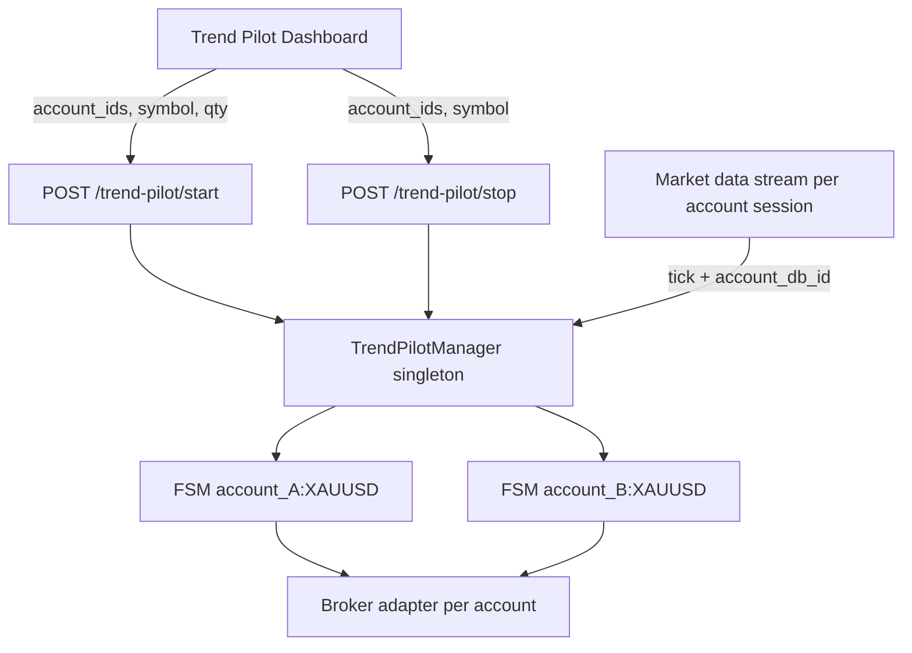

# Trend Pilot porting guide — mt5-platform → CryptoBridge

> **Archived / historical.** Trend Pilot and its `/trend-pilot/*` routes were removed from this platform (see `docs/skills/automation.md`). Keep this guide only as a reference for porting the old behavior into CryptoBridge or other forks. Do not use it to revive Trend Pilot here.

This document describes the **Trend Pilot** changes shipped in mt5-platform commit `264e14f` so you can apply the same behavior in **CryptoBridge**. It covers two related features:

1. **Live/backtest parity** — live execution matches backtest semantics (always-in-position, 2× reversal stops, H4 roll behavior, gap recovery, funded loss cap).
2. **Multi-account live runs** — start/stop Trend Pilot on one or more broker accounts in parallel, with a strategy-specific account picker in the UI.

Read this as a **checklist + contract reference**, not a line-by-line copy. CryptoBridge may use different broker adapters, collection names, or UI structure; keep the **invariants** and **API shapes** the same.

---

## 1. Problem being solved

### Before (single-account, live/backtest drift)

| Area | Old behavior | Risk |
|------|--------------|------|
| Registry key | `symbol` only | Two accounts on same symbol would collide |
| Tick routing | All FSMs for a symbol received every tick | Wrong account could process another account’s tick |
| Reversal | Tick-based `_reverse()` or `modify_position` trail | Live fills did not match backtest roll logic |
| H4 roll timing | Wall-clock bucket | Window refreshed at wrong time vs broker candles |
| Start/stop API | Implicit “selected account” only | No way to run on Account A + B together |
| UI | One active run card | No per-account visibility |

### After (target state)

| Area | New behavior |
|------|--------------|
| Registry key | `{account_id}:{normalized_symbol}` |
| Tick routing | Pass `account_id` from the price stream session into `handle_price` |
| Reversal | 2× pending stop at stored SL; detect broker fill to flip side |
| H4 roll | Refresh when broker `c2_time` advances |
| Gap | Adverse gap through SL → cancel stop/limit, market 2× opposite, re-arm stop |
| Loss cap (live only) | At `loss_cap_exit_pct` of leg equity → close, market same side, re-arm 2× stop |
| Start/stop API | `account_ids: string[]` with partial success reporting |
| UI | Multi-select checkboxes; list all active runs; show account on history rows |

---

## 2. Architecture overview



**Invariants**

- One FSM instance per **(user, account, broker symbol)** while live.
- FSM holds its own `account` dict, `run_id`, orders, position state, and H4 window.
- Manager is thread-safe (`RLock`); never share mutable FSM state across accounts.
- Strategy type guard (`strategy_type == "trend_pilot"`) on every tick entry.

---

## 3. API contract changes

### 3.1 Request schemas

```python
class TrendPilotStartIn(BaseModel):
    symbol: str = "XAUUSD"
    quantity: float = 0.01
    account_ids: list[str] = []          # NEW — empty = fallback to selected account
    funded_loss_cap_enabled: bool = True
    loss_cap_exit_pct: float = 0.95
    max_trade_loss_pct: float = 1.0

class TrendPilotStopIn(BaseModel):
    symbol: str = "XAUUSD"
    close_position: bool = True
    account_ids: list[str] = []          # NEW — empty = stop all user runs for symbol
```

### 3.2 `POST /trend-pilot/start`

**Behavior**

1. Resolve accounts via `_resolve_trend_pilot_accounts(user, db, data.account_ids)`.
   - If `account_ids` is empty → use the user’s currently selected broker account (existing behavior).
   - If non-empty → validate each id belongs to the user and is an eligible account type (international MT5 in mt5-platform; map to CryptoBridge’s equivalent).
   - Deduplicate ids; reject invalid ObjectIds.
2. For **each** account (sequential loop is fine):
   - Resolve broker symbol + H4 window (c1, c2, high, low).
   - Check conflicts (e.g. another strategy active on same account+symbol).
   - Call `trend_pilot_manager.start_run(..., account=account, ...)`.
   - Collect per-account errors without aborting the whole batch.
3. If **zero** accounts started → `400` with first error message.
4. If **≥1** started → `200` with batch response (even if some accounts failed).

**Response shape (breaking change from single snapshot)**

```json
{
  "runs": [
    {
      "run_id": "...",
      "account_id": "...",
      "account_name": "My FTMO",
      "symbol": "XAUUSD",
      "display_symbol": "XAUUSD+",
      "state": "ARMED",
      "window_high": 2650.12,
      "window_low": 2620.45,
      "roll_count": 0,
      "cumulative_pnl": 0,
      "funded_loss_cap_enabled": true,
      "loss_cap_exit_pct": 0.95
    }
  ],
  "started_count": 1,
  "errors": [
    { "account_id": "...", "error": "Trap Reversal is already active for this symbol." }
  ]
}
```

**CryptoBridge note:** Update any client that expected the start endpoint to return a single run object directly.

### 3.3 `POST /trend-pilot/stop`

**Behavior**

- If `account_ids` provided → `stop_runs_for_accounts(...)` (one `stop_run` per id).
- If `account_ids` empty → `stop_run(...)` for **all** active runs matching `symbol` + `user_id` (all accounts).

**Response shapes**

Single-account stop (via `stop_run`):

```json
{
  "ok": true,
  "removed": true,
  "symbol": "XAUUSD",
  "run_id": "...",
  "stopped_count": 2
}
```

Multi-account stop (via `stop_runs_for_accounts`):

```json
{
  "ok": true,
  "removed": 2,
  "results": [
    { "account_id": "...", "ok": true, "removed": true, "symbol": "XAUUSD", "run_id": "..." },
    { "account_id": "...", "ok": true, "removed": false }
  ]
}
```

### 3.4 `GET /trend-pilot/active`

Unchanged route; response is now **always** a list:

```json
{ "runs": [ /* 0..N snapshots */ ] }
```

Each snapshot must include `account_id` and `account_name`.

### 3.5 `GET /trend-pilot/runs` (history list)

Each list item should include:

```json
{
  "run_id": "...",
  "account_id": "...",
  "account_name": "...",
  "symbol": "XAUUSD",
  "display_symbol": "XAUUSD+",
  "status": "stopped",
  "roll_count": 12,
  "total_pnl": 145.20,
  "closed_trades": 6,
  "max_drawdown": 32.10
}
```

Backtest endpoints stay **single-account** (selected account only). Multi-select applies to **Live** mode only.

---

## 4. Backend implementation checklist

### 4.1 Account resolution helper

Port `_resolve_trend_pilot_accounts` from `apps/backend-python/app/main.py`:

```python
async def _resolve_trend_pilot_accounts(user, db, account_ids: list[str]) -> list[dict]:
    if not account_ids:
        return [await _assert_account_async(user, db)]  # existing selected-account helper
    accounts = []
    seen = set()
    for raw_id in account_ids:
        account_key = str(raw_id or "").strip()
        if not account_key or account_key in seen:
            continue
        seen.add(account_key)
        account_oid = parse_object_id(account_key)  # 400 on invalid
        account = await _lookup_eligible_account_async(user["_id"], account_oid, db)
        if not account:
            raise HTTPException(404, f"Account not found: {account_key}")
        accounts.append(account)
    if not accounts:
        raise HTTPException(400, "Select at least one account.")
    return accounts
```

**CryptoBridge:** Replace `_lookup_international_account_async` with your account lookup (exchange API keys, sub-accounts, etc.). Keep the same empty-vs-explicit `account_ids` semantics.

### 4.2 TrendPilotManager registry

**File:** `trend_pilot_runtime.py` (or CryptoBridge equivalent)

| Method | Change |
|--------|--------|
| `_run_key(account_id, symbol)` | Return `f"{account_id}:{normalize_symbol(symbol)}"` |
| `start_run` | Check duplicate key **before** `create_run`; reject if already active |
| `stop_run` | Support `account_id` kwarg; without it, stop **all** matching user+symbol runs |
| `stop_runs_for_accounts` | Loop `account_ids`, aggregate `removed` count |
| `handle_price` | Add `account_id: Optional[str]`; route to single FSM when set |
| `active_symbols` | Filter by `account_db_id` when provided |
| `snapshot_for_user` | Return list of all user FSMs (include `account_id`, `account_name`) |

**Duplicate guard (critical)**

```python
key = self._run_key(account["_id"], broker_symbol)
with self._lock:
    if key in self.active_runs:
        raise RuntimeError("Trend Pilot is already active for this account and symbol.")
# then create_run + build FSM + register
```

### 4.3 Tick routing

**File:** `market_data_stream.py` (or wherever per-account ticks are dispatched)

**Before:**

```python
await trend_pilot_manager.handle_price(db, symbol, tick)
```

**After:**

```python
await trend_pilot_manager.handle_price(
    db,
    symbol,
    tick,
    str(account_db_id) if account_db_id else None,
)
```

**CryptoBridge:** Ensure your price feed is **per connected account/session**. If CryptoBridge multiplexes one websocket for all accounts, you must still tag each tick with the originating `account_id` before calling `handle_price`.

### 4.4 Live execution rules (parity)

These live-only behaviors must match backtest semantics. See `trend_pilot_runtime.py` and shared `trend_pilot_roll_events.py`.

| Phase | Rule |
|-------|------|
| **ARMED** | Place 1× BUY STOP + 1× SELL STOP at buffered H4 window levels |
| **Entry fill** | Cancel unused entry stop; place **2× qty** reversal pending stop at stored SL |
| **In trade** | Do **not** trail SL via `modify_position`; only cancel/replace the reversal stop |
| **Reversal** | Detect reversal stop fill from broker pending orders → flip side, persist `REVERSAL` roll |
| **H4 roll** | When broker `c2_time` changes, recompute window; cancel/replace 2× reversal stop at new `updated_sl` |
| **Gap through SL** | If price gaps adversely through SL (stop may become limit): cancel, market 2× opposite, re-arm stop |
| **Loss cap** | Live only: unrealized loss ≥ `loss_cap_exit_pct` % of `leg_equity_basis` → close, market same side, re-arm 2× stop; emit `LOSS_CAP_RESET` |
| **Session end** | Close position; emit session-close roll event |

**Shared roll payload:** Port `build_roll_payload()` so live `order_events` and backtest `rolls[]` use identical field names (`updated_sl`, `running_pnl`, `h4_close`, `price_buffer_usd`, etc.).

### 4.5 Persistence

**Run documents** — already store `account_id` on `trend_pilot_runs` / equivalent. No schema migration required if field exists.

**History list serializer** — add lookup for display:

```python
"account_id": str(doc.get("account_id") or ""),
"account_name": <from accounts collection>,
```

**Live analytics** — run `compute_backtest_analytics(rolls)` on live roll events when building history summary (same metrics as backtest: `closed_trades`, `max_drawdown`, streaks, max DD duration).

### 4.6 Conflict checks

In mt5-platform, start is blocked per account if Trap Reversal is active on the same symbol:

```python
trap_reversal_manager.active_symbols(user_id, account["_id"]) & {normalize_symbol(broker_symbol)}
```

**CryptoBridge:** Apply the same pattern for any mutually exclusive strategies on `(account, symbol)`.

---

## 5. Frontend implementation checklist

### 5.1 Props wiring

Parent shell (mt5-platform: `App.jsx`) passes:

```jsx
<TrendPilotDashboard
  token={token}
  selectedAccountExists={selectedAccountExists}
  internationalAccounts={internationalAccounts}   // all eligible accounts
  selectedAccountId={me?.selected_account_id}     // terminal-selected account
  onNotify={notify}
/>
```

**CryptoBridge:** Pass your equivalent account list (all exchange/broker accounts the user can run strategies on).

### 5.2 Account multi-select state (Live only)

Key behaviors in `TrendPilotDashboard.jsx`:

1. **Initialize once** on first load → default to `[selectedAccountId]` or first account.
2. **Do not re-select** terminal account when user clears all checkboxes (use `useRef` guard).
3. **Filter invalid ids** when account list changes; preserve user’s empty selection.
4. **Start/Stop** send `account_ids: selectedAccountIds`.
5. **Disable Start/Stop** when `selectedAccountIds.length === 0`.
6. **Still fetch** active runs + history when zero accounts selected (`liveViewReady` ≠ `canRunLive`).

```javascript
const accountSelectionInitializedRef = useRef(false);

useEffect(() => {
  if (!accounts.length) {
    setSelectedAccountIds([]);
    accountSelectionInitializedRef.current = false;
    return;
  }
  setSelectedAccountIds((current) => {
    const valid = current.filter((id) => accounts.some((a) => a.id === id));
    if (accountSelectionInitializedRef.current) return valid;  // allows []
    accountSelectionInitializedRef.current = true;
    if (selectedAccountId && accounts.some((a) => a.id === selectedAccountId)) {
      return [selectedAccountId];
    }
    return [accounts[0].id];
  });
}, [accounts, selectedAccountId]);
```

**Important:** This “terminal account can be unchecked” behavior is **intentional for Trend Pilot only**. Do not change global terminal account selection or other strategies’ copy-account rules.

### 5.3 Start mutation response handling

**Before:** treated response as single run snapshot.

**After:**

```javascript
onSuccess: (result) => {
  const startedCount = result?.started_count ?? result?.runs?.length ?? 0;
  const errors = result?.errors ?? [];
  // notify success / partial success / failure
  invalidateQueries(["trend-pilot"]);
}
```

### 5.4 Active runs UI

Replace single `activeRun` with `activeRuns = data?.runs || []` and render a card per run, showing:

- `display_symbol`
- `account_name`
- `state`, `current_side`, `roll_count`, `cumulative_pnl`
- window levels / loss cap settings

### 5.5 History rows

In `TrendPilotBacktestRow` (live mode), show `account_name` next to symbol:

```jsx
{mode === "live" && result.account_name ? (
  <span className="...">{result.account_name}</span>
) : null}
```

---

## 6. File map (mt5-platform reference)

Use this when diffing commit `264e14f`:

| Layer | Files |
|-------|-------|
| API routes | `apps/backend-python/app/main.py` |
| Schemas | `apps/backend-python/app/schemas.py` |
| Runtime | `apps/backend-python/app/services/trend_pilot_runtime.py` |
| Roll payloads | `apps/backend-python/app/services/trend_pilot_roll_events.py` |
| Persistence | `apps/backend-python/app/services/trend_pilot_persistence.py` |
| Tick routing | `apps/backend-python/app/services/market_data_stream.py` |
| Dashboard | `apps/frontend-react/src/pages/TrendPilotDashboard.jsx` |
| History row | `apps/frontend-react/src/components/trend-pilot/TrendPilotBacktestRow.jsx` |
| Roll row | `apps/frontend-react/src/components/trend-pilot/TrendPilotRollRow.jsx` |
| Shell props | `apps/frontend-react/src/App.jsx` |
| Skill doc | `docs/skills/automation.md` |

---

## 7. CryptoBridge adaptation notes

| mt5-platform concept | CryptoBridge equivalent |
|---------------------|-------------------------|
| `meta_accounts` / international MT5 | Your broker/exchange account collection |
| `account["_id"]` registry key | Stable internal account document id |
| `broker_symbol` vs `requested_symbol` | Mapped instrument id vs UI symbol |
| `metaapi_service` / local MT5 adapter | CryptoBridge order placement service |
| `trap_reversal_manager` conflict | Any strategy that monopolizes account+symbol |
| `internationalAccounts` in UI | All accounts eligible for this strategy |
| H4 candles from MT5 | H4 candles from CryptoBridge market data source |
| `leg_equity_basis` for loss cap | Account equity / margin basis at leg open |

**Do not port blindly:** CryptoBridge may not have pending stop orders. If orders are market-only, you must emulate “2× reversal stop” with internal price triggers + market orders while keeping the same state machine transitions and roll event schema.

---

## 8. Testing checklist

### Backend

- [ ] Start with `account_ids: [A, B]` → two FSMs, two `run_id`s, both in `GET /active`.
- [ ] Start same account+symbol twice → second returns error in `errors[]`, first unchanged.
- [ ] Tick for account A does not advance FSM for account B on same symbol.
- [ ] Stop with `account_ids: [A]` leaves B running.
- [ ] Stop with empty `account_ids` stops all user runs for symbol.
- [ ] `GET /runs` includes `account_id` and `account_name`.
- [ ] Reversal fill flips side and emits roll with `updated_sl`.
- [ ] H4 `c2_time` change triggers window roll (not wall clock).
- [ ] Gap-through-SL path fires only on adverse gap (not normal stop fill).
- [ ] Loss cap resets same side and emits `LOSS_CAP_RESET` (live only).

### Frontend

- [ ] Default selection = terminal account on first visit.
- [ ] Unchecking terminal account stays unchecked (no auto re-tick).
- [ ] Clear → Start/Stop disabled; active/history still visible.
- [ ] Partial start shows warning toast with counts.
- [ ] Multiple active run cards render with correct account labels.

---

## 9. Rollout order (recommended)

1. **Manager registry + tick routing** — prevents cross-account bugs before exposing multi-start UI.
2. **API batch start/stop + schemas** — keep old clients working via empty `account_ids` fallback.
3. **Live/backtest parity runtime** — if not already on CryptoBridge.
4. **Persistence + history `account_name`** — API completeness.
5. **Frontend multi-select + active run list** — user-facing feature.
6. **Docs + tests** — lock behavior before production.

---

## 10. Related changelog entries (mt5-platform)

- `docs/changelog/2026-07-18-trend-pilot-live-backtest-parity.md`
- `docs/changelog/2026-07-18-trend-pilot-multi-account-live.md`
- `docs/skills/automation.md` — REST surface and live execution summary

---

## 11. Quick reference — breaking changes for integrators

| Endpoint | Breaking change | Migration |
|----------|-----------------|-----------|
| `POST /trend-pilot/start` | Returns `{ runs, started_count, errors }` not a single snapshot | Read `result.runs[0]` if you only support one account |
| `POST /trend-pilot/stop` | `removed` may be a count (int) in batch mode | Treat truthy `removed` as success |
| `GET /trend-pilot/active` | Always `{ runs: [] }` even for zero runs | Stop assuming a single object at root |

Non-breaking: empty `account_ids` preserves previous “selected account” / “stop all” semantics.
